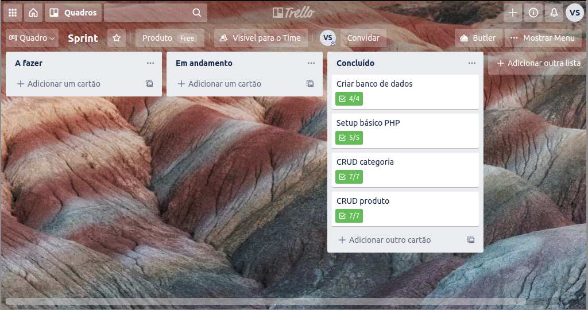
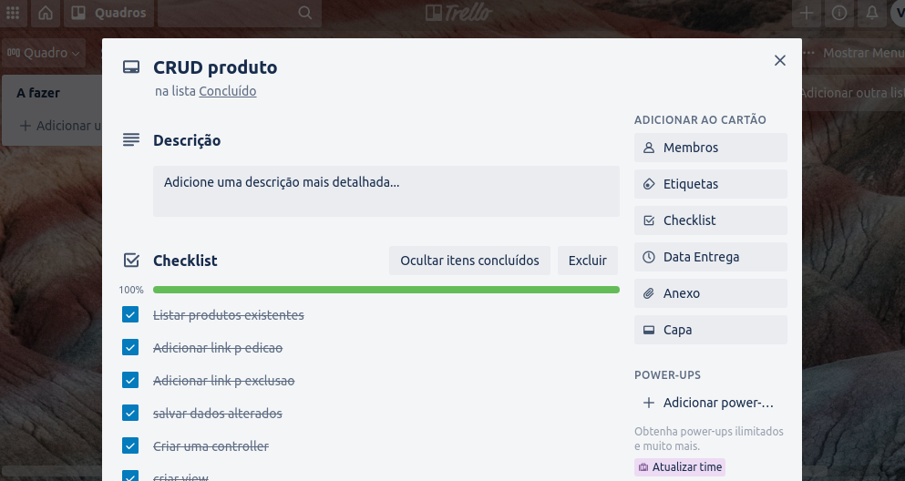
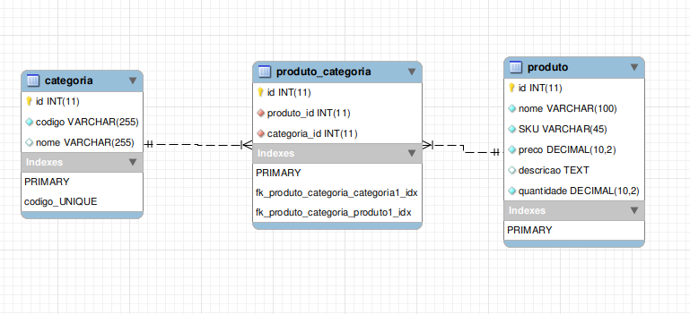

# Como rodar esta solução

1. Clone este repositório
2. Execute o script salvo em `/scripts/ecommerce.sql` para criar o banco de dados
3. Crie um host no seu servidor apontando para o diretório `/public` deste projeto
4. Faça uma cópia do arquivo `/app/etc/config.php.inc` para `/app/etc/config.php`
5. Edite a sua versão de `config.php` e coloque as configurações de conexão ao seu MySQL
6. Acesse o site com o seu browser

## Requisitos do sistema
* PHP 7.x
* MySQL 5.7
* Apache 2.4 (opcional)

## Sprint

Como parte do exercício foi simulada uma sprint através da ferramenta [Trello](https://trello.com/b/A9Dni7rH/sprint):

## Banco de dados

O MySQL Workbench foi utilizado para modelagem de dados:

## Autor

*Vinicius Santos*

* [LinkedIn](https://www.linkedin.com/in/vinicius-gsantos)
* [Currículo](./docs/CV_-_Vinicius_Santos.pdf)
